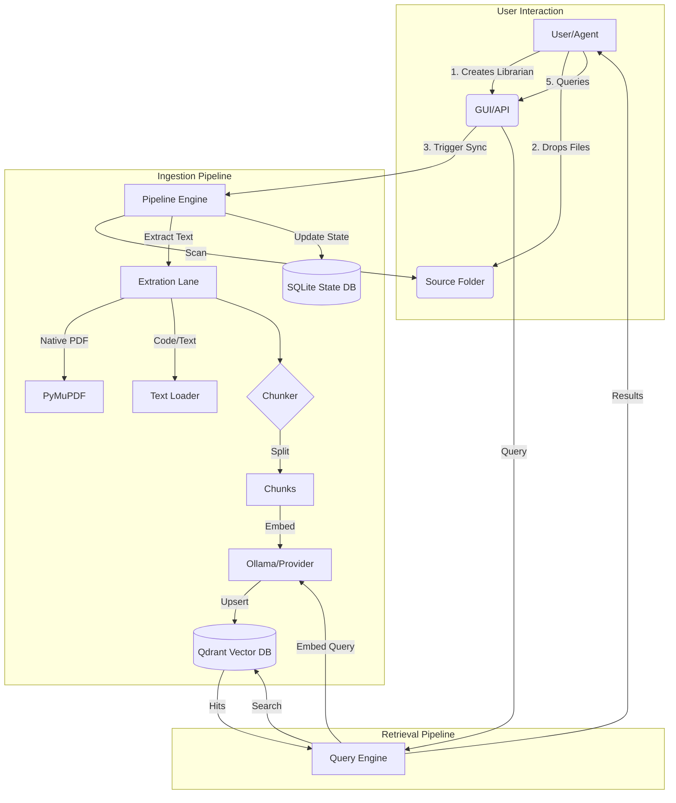

# RAG Librarian (Custodian)

A local-first "Librarian" service that ingests documents from themed folders (corpora), deduplicates them by content hash, extracts text, chunks intelligently, embeds, and stores everything in a persistent vector index (Qdrant) for retrieval with citations.

## Architecture & Dataflow



## Features

- **Local-first**: Designed for on-prem usage.
- **Idempotent Ingestion**: Skips duplicates, handles incremental updates.
- **Lane-based Extraction**: Native PDF or OCR (Tesseract/OCRmyPDF).
- **Persistent State**: SQLite tracking of every file and chunk.

## Requirements

- Python 3.11+
- Qdrant (via Docker recommended)
- Optional: Tesseract OCR, Ghostscript (for OCR features)

## Quickstart

### 1. Setup

Run the setup script to create folders and install dependencies:

```powershell
./scripts/windows/setup.ps1
```

### 2. Configure

Edit `config.yaml` to set your paths and provider settings.
Edit `rag_library/corpora/*/corpus.yaml` for corpus-specific settings.

### 3. Start Infrastructure

Start Qdrant using Docker:

```bash
docker-compose up -d qdrant
```

### 4. Initialize Database

```powershell
./scripts/windows/init_state_db.ps1
```

### 5. Run the Service

```powershell
./scripts/windows/run.ps1
```

The API will be available at `http://localhost:8008`.

## Folder Structure

- `app/`: Source code
- `rag_library/`: Default location for your documents (inbox) and database.
- `scripts/`: Helper scripts for Windows and Docker.

## Usage

Drop files into `rag_library/corpora/<corpus_id>/inbox` and run ingestion (API or script coming soon).

## Code Quality & Security

The codebase has undergone a comprehensive code review with 33 issues addressed:

### Security Improvements
- **Path Traversal Protection**: All corpus IDs are validated against strict regex patterns with path resolution verification
- **Environment Variable Safety**: Removed global `os.environ` mutations; providers use explicit configuration
- **YAML Sanitization**: User inputs are sanitized before writing to YAML files using `yaml.safe_dump()`

### Architecture Improvements
- **Thread-Safe Database**: SQLite connections use thread-local storage with WAL mode for concurrent access
- **Dependency Injection**: FastAPI routes use proper `Depends()` pattern instead of module-level globals
- **Async Non-Blocking I/O**: Blocking operations run via `asyncio.to_thread()` to avoid event loop blocking
- **Centralized Services**: `CorpusService` provides single source of truth for corpus operations

### Resource Management
- **Database Lifecycle**: All database connections properly closed via generators with cleanup
- **PDF Handling**: Proper `try/finally` blocks ensure file handles are released
- **Collection Caching**: Qdrant collection existence checks use O(1) lookups with caching

See `20260129_Changelog.md` for the complete list of changes.

## CLI Commands

```bash
# Initialize the database
python -m app.cli init-db

# Start the server
python -m app.cli serve

# Run ingestion for a corpus
python -m app.cli ingest --corpus <corpus_id>
```

transcripts