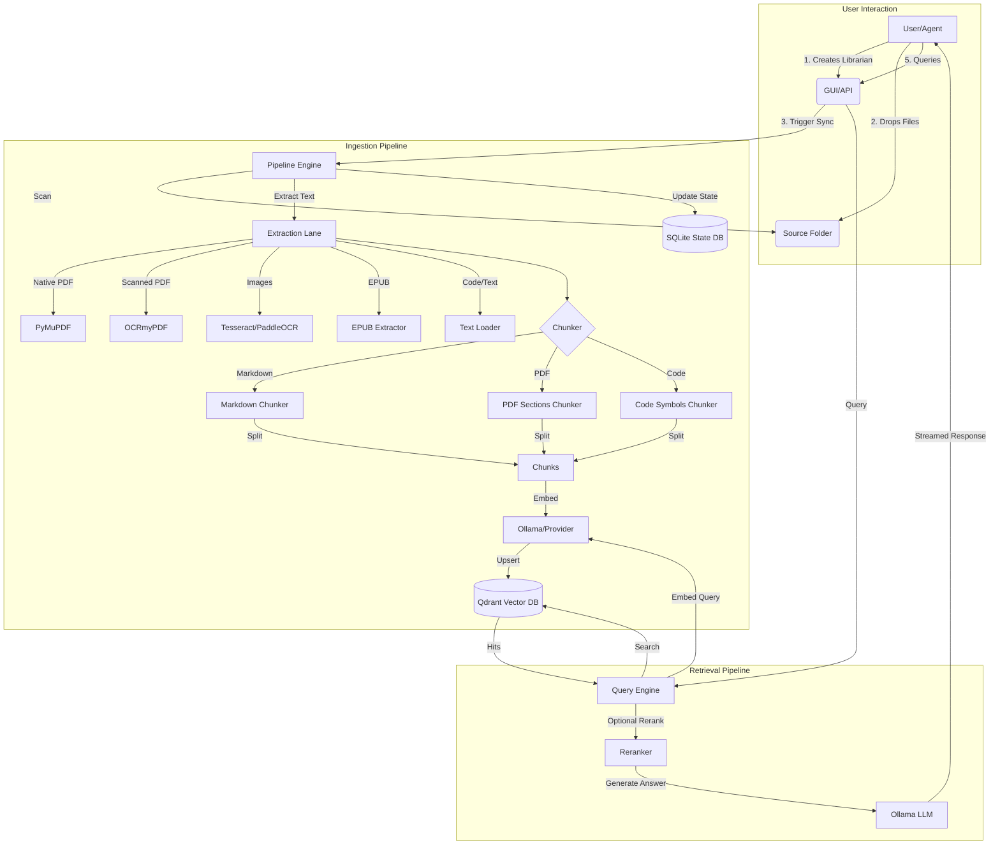

# RAG Librarian (Custodian)

A local-first "Librarian" service that ingests documents from themed folders (corpora), deduplicates them by content hash, extracts text, chunks intelligently, embeds, and stores everything in a persistent vector index (Qdrant) for retrieval with citations. Includes a web GUI for search, corpus management, and system monitoring.

## Architecture & Dataflow


```mermaid
graph TD
    subgraph User Interaction
    A[User/Agent] -->|1. Creates Librarian| B(GUI/API)
    A -->|2. Drops Files| C(Source Folder)
    A -->|5. Queries| B
    end

    subgraph Ingestion Pipeline
    B -->|3. Trigger Sync| D[Pipeline Engine]
    D -->|Scan| C
    D -->|Extract Text| E[Extraction Lane]
    E -->|Native PDF| F[PyMuPDF]
    E -->|Scanned PDF| F2[OCRmyPDF]
    E -->|Images| F3[Tesseract/PaddleOCR]
    E -->|EPUB| F4[EPUB Extractor]
    E -->|Code/Text| G[Text Loader]
    E --> H{Chunker}
    H -->|Markdown| H1[Markdown Chunker]
    H -->|PDF| H2[PDF Sections Chunker]
    H -->|Code| H3[Code Symbols Chunker]
    H1 & H2 & H3 -->|Split| I[Chunks]
    I -->|Embed| J[Ollama/Provider]
    J -->|Upsert| K[(Qdrant Vector DB)]
    D -->|Update State| L[(SQLite State DB)]
    end

    subgraph Retrieval Pipeline
    B -->|Query| M[Query Engine]
    M -->|Embed Query| J
    M -->|Search| K
    K -->|Hits| M
    M -->|Optional Rerank| N[Reranker]
    N -->|Generate Answer| O[Ollama LLM]
    O -->|Streamed Response| A
    end
```

## Features

- **Local-first**: Designed for on-prem usage with no external API calls required.
- **Web GUI**: Interactive dashboard, RAG search interface, and corpus management pages (HTMX-powered).
- **LLM-powered Answers**: Queries return both vector search hits and streamed LLM-generated answers with citations.
- **Idempotent Ingestion**: SHA-256 hash-based deduplication; skips already-processed files and handles incremental updates.
- **Lane-based Extraction**: Intelligent routing for PDF, EPUB, PNG, JPG, JPEG, and TIFF files.
- **OCR Fallback**: PDF extraction falls back to OCR per-page if text is sparse (configurable density threshold). Supports multiple OCR backends: Tesseract, OCRmyPDF, and PaddleOCR.
- **Multiple Chunking Strategies**:
  - **Markdown**: Header-aware splitting that merges small sections while preserving structure.
  - **PDF Sections**: Paragraph-based chunking with configurable overlap for context preservation.
  - **Code Symbols**: Python function/class-aware chunking.
- **Per-Corpus Configuration**: Each corpus can define its own chunking strategy, LLM model, and settings via `corpus.yaml`.
- **Discord / OpenClaw Integration**: Dedicated CLI command to ingest downloaded files directly into a corpus.
- **Vector Storage Optimization**: Configurable embedding dimensions, on-disk Qdrant storage, and collection caching.
- **Streaming Responses**: LLM answers stream to the browser in real time.
- **Reranking Support**: Optional post-retrieval reranking stage (pluggable).

## Requirements

- Python 3.11+
- [Ollama](https://ollama.com/) (for embeddings and LLM inference)
- Qdrant (via Docker recommended)
- Optional: Tesseract OCR, Ghostscript, OCRmyPDF, PaddleOCR (for OCR features)

## Quickstart

### 1. Setup

Run the setup script to create folders and install dependencies:

**Windows (PowerShell):**
```powershell
./scripts/windows/setup.ps1
```

**Linux/macOS:**
```bash
./scripts/linux/setup.sh
```

### 2. Configure

Copy `.env.example` to `.env` and edit as needed:

```bash
cp .env.example .env
```

Key settings in `.env`:
- `API_PORT` - Server port (default: 8008)
- `QDRANT_URL` - Qdrant connection URL
- `EMBED_PROVIDER` / `EMBED_MODEL` - Embedding provider and model name
- `LIBRARY_ROOT` - Root directory for corpora and data

Edit `config.yaml` for detailed system configuration (extraction, OCR, chunking defaults, vector DB settings).

Edit `rag_library/corpora/*/corpus.yaml` for corpus-specific settings (chunking strategy, LLM model overrides).

### 3. Start Infrastructure

Start Qdrant using Docker:

```bash
docker-compose up -d qdrant
```

### 4. Initialize Database

**Windows (PowerShell):**
```powershell
./scripts/windows/init_state_db.ps1
```

**Linux/macOS:**
```bash
./scripts/linux/init_state_db.sh
```

### 5. Run the Service

**Windows (PowerShell):**
```powershell
./scripts/windows/run.ps1
```

**Linux/macOS:**
```bash
./scripts/linux/run.sh
```

The service will be available at `http://localhost:8008`.

### Full Docker Deployment

To run both Qdrant and the Librarian service together:

```bash
docker-compose up -d
```

This starts both services with persistent volumes for the library and state data.

## Web GUI

The built-in web interface is available at `http://localhost:8008/gui/` and includes:

- **Dashboard** (`/gui/dashboard`) - System health overview, corpus cards with document/chunk counts, vector statistics.
- **Search** (`/gui/search`) - Interactive RAG chat interface. Select a corpus, ask questions, and get LLM-generated answers with source citations.
- **Corpora** (`/gui/corpora`) - List and manage all corpora.
- **Manage Corpus** (`/gui/manage-corpus/<id>`) - Configure corpus-specific settings.
- **Create Corpus** (`/gui/create-corpus`) - Create a new corpus with its own inbox folder and configuration.

## API Endpoints

| Method | Path | Description |
|--------|------|-------------|
| `GET` | `/health` | Health check |
| `POST` | `/api/query` | Execute a RAG query (JSON body: `query`, `corpus_id`, `top_k`, `llm_model`) |
| `GET` | `/api/query/models` | List available LLM models |
| `POST` | `/api/ingest/run` | Trigger ingestion (optional `corpus_id` query param) |
| `GET` | `/gui/*` | Web GUI pages (dashboard, search, corpora, manage, create) |

## Folder Structure

```
app/                    # Application source code
  api/                  #   REST API routes (health, query, ingest)
  gui/                  #   Web GUI (templates, static assets, routes)
  ingest/               #   Ingestion pipeline and chunkers
  engines/              #   Text extractors (PDF, EPUB, image, OCR)
  vector/               #   Qdrant vector DB client
  state/                #   SQLite state database and schema
  providers/            #   Embedding/LLM providers (Ollama)
  services/             #   Corpus service
  config/               #   Configuration loading and schemas
  utils/                #   Logging, hashing utilities
  cli.py                #   CLI entry point
rag_library/            # Default data directory
  corpora/              #   Document corpora (each with inbox/ and corpus.yaml)
  state/                #   SQLite database
  cache/                #   OCR cache
scripts/                # Setup and run scripts
  linux/                #   Bash scripts (setup, init_state_db, run)
  windows/              #   PowerShell scripts (setup, init_state_db, run)
tests/                  # Pytest integration tests
config.yaml             # Global system configuration
.env.example            # Environment variable template
Dockerfile              # Container image definition
docker-compose.yml      # Qdrant + Librarian service orchestration
pyproject.toml          # Python package definition (Poetry)
```

## Usage

1. Drop files into `rag_library/corpora/<corpus_id>/inbox`.
2. Trigger ingestion via the API (`POST /api/ingest/run`), the CLI (`python -m app.cli ingest --corpus <id>`), or the web GUI.
3. Query via the search GUI at `/gui/search` or the API at `POST /api/query`.

## CLI Commands

```bash
# Initialize the database
python -m app.cli init-db

# Start the server
python -m app.cli serve

# Run ingestion for a corpus
python -m app.cli ingest --corpus <corpus_id>

# Ingest a specific downloaded file directly into a corpus (e.g., from Discord/OpenClaw)
python -m app.cli ingest-file /path/to/downloaded/file.pdf --corpus <corpus_id>
```

## Testing

```bash
pytest tests/
```

## Code Quality & Security

The codebase has undergone a comprehensive code review with 33 issues addressed:

### Security Improvements
- **Path Traversal Protection**: All corpus IDs are validated against strict regex patterns with path resolution verification
- **Environment Variable Safety**: Removed global `os.environ` mutations; providers use explicit configuration
- **YAML Sanitization**: User inputs are sanitized before writing to YAML files using `yaml.safe_dump()`

### Architecture Improvements
- **Thread-Safe Database**: SQLite connections use thread-local storage with WAL mode for concurrent access
- **Dependency Injection**: FastAPI routes use proper `Depends()` pattern instead of module-level globals
- **Async Non-Blocking I/O**: Blocking operations run via `asyncio.to_thread()` to avoid event loop blocking
- **Centralized Services**: `CorpusService` provides single source of truth for corpus operations

### Resource Management
- **Database Lifecycle**: All database connections properly closed via generators with cleanup
- **PDF Handling**: Proper `try/finally` blocks ensure file handles are released
- **Collection Caching**: Qdrant collection existence checks use O(1) lookups with caching

See `20260129_Changelog.md` for the complete list of changes.

## Migration Notes

**Vector Dimensions:** The default vector size is now inferred dynamically or read from `config.yaml` (`vector_db.vector_size`). If you see dimension mismatch errors in existing corpora, you may need to recreate your Qdrant collection or explicitly set `vector_size` in your configuration to match your original embedding size. On-disk storage (`on_disk`, `hnsw_on_disk`) is also now enabled by default.
