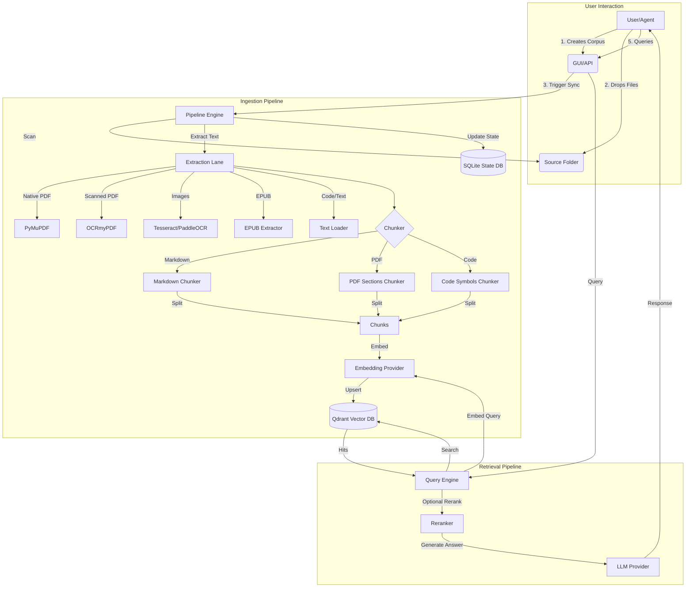

# RAGnificent

<div align="center">

**Built in an afternoon because every other local RAG setup was either
too simple to be useful or too complex to actually run.**

[](https://opensource.org/licenses/MIT)
[](https://www.python.org/)
[](https://qdrant.tech/)
[](https://ollama.com/)

</div>

RAGnificent is a document intelligence service that runs locally or connects to cloud AI providers. Drop files into a folder, trigger a sync, and get a persistent queryable vector index back with LLM answers and citations. Each corpus gets its own isolated Qdrant collection, its own chunking strategy, its own answer model, and now its own embedding configuration. No shared state between document sets.

---

## Jazzy Workspace Gateway

In the full `D:\Jazzy` stack, RAGnificent runs directly at `http://localhost:8018` and is also exposed through AgentsOfJazzy authenticated proxy endpoints:

- `http://localhost:9002/v1/ragnificent/health`
- `http://localhost:9002/v1/ragnificent/corpora`
- `http://localhost:9002/v1/ragnificent/ingest/run`
- `http://localhost:9002/v1/ragnificent/query`

AgentsOfJazzy gets its `x-auth` token from `D:\Jazzy\JazzyTheAI\.env` `AGENTS_AUTH`, so JazzyTheAI can call RAGnificent through AgentsOfJazzy without maintaining a second shared token.

---

## What Makes This Different

| | Typical local RAG | RAGnificent |
|---|---|---|
| **Corpus isolation** | Shared index | Per-corpus Qdrant collection |
| **Chunking** | One fixed strategy | Markdown / PDF / Code-aware routing |
| **PDF handling** | Text extraction only | OCR fallback per-page when text is sparse |
| **Deduplication** | None | SHA-256 content hash, idempotent ingest |
| **Config** | Global only | Per-corpus `corpus.yaml` overrides |
| **Interface** | CLI or nothing | Web GUI + REST API + CLI |
| **AI providers** | Local only | Ollama, OpenAI, Anthropic, OpenRouter |
| **Deployment** | Script or nothing | Docker Compose or bare Python |

---

## Architecture


```mermaid
graph TD
    subgraph User Interaction
    A[User/Agent] -->|1. Creates Corpus| B(GUI/API)
    A -->|2. Drops Files| C(Source Folder)
    A -->|5. Queries| B
    end

    subgraph Ingestion Pipeline
    B -->|3. Trigger Sync| D[Pipeline Engine]
    D -->|Scan| C
    D -->|Extract Text| E[Extraction Lane]
    E -->|Native PDF| F[PyMuPDF]
    E -->|Scanned PDF| F2[OCRmyPDF]
    E -->|Images| F3[Tesseract/PaddleOCR]
    E -->|EPUB| F4[EPUB Extractor]
    E -->|Code/Text| G[Text Loader]
    E --> H{Chunker}
    H -->|Markdown| H1[Markdown Chunker]
    H -->|PDF| H2[PDF Sections Chunker]
    H -->|Code| H3[Code Symbols Chunker]
    H1 & H2 & H3 -->|Split| I[Chunks]
    I -->|Embed| J[Embedding Provider]
    J -->|Upsert| K[(Qdrant Vector DB)]
    D -->|Update State| L[(SQLite State DB)]
    end

    subgraph Retrieval Pipeline
    B -->|Query| M[Query Engine]
    M -->|Embed Query| J
    M -->|Search| K
    K -->|Hits| M
    M -->|Optional Rerank| N[Reranker]
    N -->|Generate Answer| O[LLM Provider]
    O -->|Response| A
    end
```

---

## Features

### Ingestion
- SHA-256 hash deduplication — skips already-processed files, handles incremental updates
- Lane-based extraction routing: PyMuPDF for native PDFs, OCRmyPDF for scanned PDFs, Tesseract/PaddleOCR for images, dedicated EPUB extractor, text/code loader
- OCR fallback per-page when text density falls below a configurable threshold
- Optional Ollama OCR lane for troublesome PDFs/images — configure a vision OCR model such as `hf.co/ggml-org/GLM-OCR-GGUF:Q8_0`; if the Ollama OCR call fails, image OCR falls back to Tesseract
- Three chunking strategies: Markdown header-aware, PDF paragraph-based with overlap, Python function/class symbol-aware
- OpenAI-compatible embedding requests are batched with retry/backoff so large PDFs and textbook-scale corpora are less likely to fail on remote embedding providers
- Live ingest progress from `/api/ingest/status` and the GUI overlay: total files, completed count, current file, processed/skipped/failed counts, percent complete
- Retry failed files from the corpus management page without re-running a full corpus scan
- Rebuild a corpus from the Manage page or API: clears that corpus's existing vectors + ingest state, then reprocesses all source files from scratch with the current pipeline

### Per-Corpus Isolation
- Each corpus gets its own Qdrant collection — no cross-contamination between document sets
- Per-corpus `corpus.yaml` overrides chunking strategy, LLM model, and embedding settings
- Embeddings are chosen at corpus creation / ingest time, not retroactively from the global Settings page
- Query-time embedding resolution follows the corpus config, so retrieval stays aligned with the vectors that corpus was built with
- Corpus-specific inbox folder; drop files and trigger sync
- Delete a corpus from the GUI — removes Qdrant collection, SQLite records, and directory

### Multi-Provider AI Support
- **Ollama** — local inference on the machine or anywhere on your LAN (`http://hostname:11434`)
- **OpenAI** — GPT-4.x, GPT-5.x, o-series models via the ChatGPT API
- **Anthropic** — Claude 3.x, Claude 4.x models via the Claude API
- **OpenRouter** — access 200+ models from a single API key (GPT, Claude, Gemini, DeepSeek, Llama, Qwen, Mistral, and more)
- Provider and model configurable globally in Settings, or overridden per-corpus

### Model Catalog
- `models_catalog.yaml` at the project root is the single source of truth for all UI dropdowns
- Organized by role (`embedding` / `llm`) and provider
- Edit this file to add, remove, or reorder models without touching any code

### Embedding Presets
- `embedding_presets.yaml` defines user-facing ingest presets such as `EPUB General`, `EPUB Technical`, `EPUB Academic`, `EPUB Budget`, `PDF General`, `PDF Technical`, `PDF Academic`, and `PDF Budget`
- Presets auto-fill embedding provider, embedding model, base URL, and chunking defaults during corpus creation
- Users can still override any preset field before deploying a corpus
- Presets are saved into each corpus config so the ingest pipeline and query path use the same embedding policy later

### Settings & Connection Testing
- `/gui/settings` — configure embedding and LLM providers, models, and base URLs from the browser
- **Test Connection** button per provider — makes a real minimal API call and shows pass/fail inline before you save
- API key status table shows which keys are loaded from your `.env` file
- Hosted provider base URLs auto-fill and stay locked to the provider default; Ollama remains editable for custom LAN / local endpoints
- The embedding section on Settings is now treated as defaults for new corpora plus a connection test harness; existing corpora keep the embedding model they were ingested with

### Retrieval
- Vector similarity search with LLM-generated answers
- Source citations returned with every response
- Optional post-retrieval reranking stage (pluggable)
- Configurable `top_k`, model selection per query

### Interface
- Web GUI: dashboard, RAG search, corpus management, corpus creation, settings
- Live feedback: spinner overlay during operations, toast notifications on completion
- Corpus creation flow includes ingest-time embedding presets plus manual overrides for provider, model, base URL, and chunking
- Corpus management page shows embedding preset, embedding model, chunking settings, failed-file count, sync progress, and a retry-failed action
- Corpus management page also includes a `Rebuild` action for full corpus reprocessing without deleting the corpus definition itself
- REST API: health, query, ingest trigger, connection test endpoints
- CLI: `init-db`, `serve`, `ingest`, `ingest-file` commands

### Engineering
- Full-restart file watcher (`watcher.py`) — detects changes to `.py`, `.html`, `.yaml`, `.css`, `.js` and restarts the entire server process tree; no stale-import issues
- Thread-safe SQLite with WAL mode and thread-local connections
- Async non-blocking I/O — blocking operations run via `asyncio.to_thread()`
- `lru_cache` singletons for services — eliminates per-request re-initialization overhead
- 30-second TTL count cache on Qdrant vector counts
- Path traversal protection: corpus IDs validated against strict regex with path resolution verification
- YAML sanitization: user inputs sanitized via `yaml.safe_dump()` before writes
- Windows and Linux run scripts auto-start local Qdrant with `docker compose up -d qdrant` when `vector_db.url` points at `localhost:6333`

---

## Quickstart

### Option 1 — Docker (recommended)

```bash
cp .env.example .env
# Edit .env and add your API keys (optional — only needed for cloud providers)
docker-compose up -d
# Service: http://localhost:8008
```

When running RAGnificent inside the full Jazzy workspace, Agent Builder owns host port `8008`. Set the host-published RAGnificent port before starting Docker:

```env
RAGNIFICENT_HOST_PORT=8018
```

With that setting, RAGnificent still listens on `8008` inside the container, but the host URL becomes:

```text
http://localhost:8018
```

AgentsOfJazzy should then use:

```env
RAGNIFICENT_URL=http://localhost:8018
```

### Option 2 — Bare Python (Windows)

```powershell
.\scripts\windows\setup.ps1
copy .env.example .env
# Edit .env and add your API keys (optional)
.\scripts\windows\init_state_db.ps1
.\scripts\windows\run.ps1
```

`setup.ps1` installs dependencies and, when `ollama` is available, pulls the required local models for the current configuration. `run.ps1` starts the full-restart watcher and, when `config.yaml` points Qdrant at `http://localhost:6333`, also tries to bring up the local `qdrant` container automatically.

### Option 3 — Bare Python (Linux/macOS)

```bash
./scripts/linux/setup.sh
cp .env.example .env
./scripts/linux/init_state_db.sh
./scripts/linux/run.sh
```

`setup.sh` installs dependencies and, when `ollama` is available, pulls the required local models for the current configuration. `run.sh` follows the same local-Qdrant auto-start behavior when `vector_db.url` is `localhost:6333`.

### Pulling Ollama models manually

```bash
python scripts/pull_ollama_models.py --mode required
python scripts/pull_ollama_models.py --mode catalog
```

`required` pulls the minimum local working set plus any Ollama OCR model configured in `config.yaml`. `catalog` pulls every Ollama model listed in `models_catalog.yaml`, plus the configured Ollama OCR model when applicable.

### Stopping the server (Windows)

```powershell
.\scripts\windows\stop.ps1
```

This kills the entire process tree (watcher + uvicorn workers) and verifies the port is clear before returning.

---

## API Keys (.env Setup)

API keys are never hardcoded. Copy `.env.example` to `.env` and fill in the keys for the providers you want to use. Ollama requires no key.

```env
# Anthropic (Claude models)
ANTHROPIC_API_KEY=sk-ant-...

# OpenAI (GPT models)
OPENAI_API_KEY=sk-...

# OpenRouter (access to 200+ models)
OPENROUTER_API_KEY=sk-or-...
```

The Settings page (`/gui/settings`) shows which keys are currently loaded.

If you change `.env`, restart the app. The watcher reloads code, templates, CSS, and YAML, but it does not watch `.env`.

---

## Usage

### Via the Web GUI

1. Open `http://localhost:8008`
2. Go to **Settings** to set provider defaults and verify API connectivity with **Test Connection**
3. Go to **Deploy New Librarian** — give it an ID, point `source_path` at any folder on the machine, and choose an **Embedding Preset** or customize the embedding + chunking settings
4. Trigger ingestion via the Manage page and watch live progress
5. Query at `/gui/search` — select a corpus, ask a question, get an answer with citations

### Via the API (for agents or scripts)

```bash
# Create a corpus pointed at any local folder
curl -X POST http://localhost:8008/api/corpora \
  -H "Content-Type: application/json" \
  -d '{"corpus_id":"my_docs","description":"My documents","source_path":"D:/documents/research","embedding_preset":"epub_general","embedding_provider":"openrouter","embedding_model":"qwen/qwen3-embedding-8b","chunk_strategy":"heading_then_paragraph","chunk_max_tokens":700,"chunk_overlap_tokens":120}'

# Trigger ingestion
curl -X POST "http://localhost:8008/api/ingest/run?corpus_id=my_docs"

# Rebuild a corpus from scratch using the current OCR/chunking/embedding pipeline
curl -X POST "http://localhost:8008/api/ingest/run?corpus_id=my_docs&rebuild=true"

# Retry only failed files for a corpus
curl -X POST "http://localhost:8008/api/ingest/run?corpus_id=my_docs&retry_failed_only=true"

# Query the database
curl -X POST http://localhost:8008/api/query \
  -H "Content-Type: application/json" \
  -d '{"query":"What is the main finding?","corpus_id":"my_docs","top_k":5}'

# Test a provider connection
curl -X POST http://localhost:8008/api/test-connection \
  -H "Content-Type: application/json" \
  -d '{"role":"llm","provider":"anthropic","model":"claude-sonnet-4-6"}'
```

### Via the CLI

```bash
python -m app.cli ingest --corpus <corpus_id>
python -m app.cli ingest --corpus <corpus_id> --rebuild
python -m app.cli ingest-file /path/to/file.pdf --corpus <corpus_id>
```

### Source path vs. inbox

Each corpus has two document locations:

| Path | Purpose |
|---|---|
| `source_path` | Any folder you point to — RAGnificent scans this for documents |
| `rag_library/corpora/<id>/inbox/` | Drop zone inside the library — also scanned during ingestion |

`source_path` is the main scan target stored in the corpus config. The per-corpus `inbox/` remains available as a drop zone inside `rag_library/`. The RAG vector database always lives in `rag_library/` regardless of where the source documents are.

---

## API Reference

CORS is fully open (`Access-Control-Allow-Origin: *`) so any client on your local network — including AI agents — can call the API without browser restrictions.

### Corpus / Database Management

| Method | Path | Description |
|--------|------|-------------|
| `GET` | `/api/corpora` | List all RAG databases with vector counts and query endpoint |
| `GET` | `/api/corpora/{corpus_id}` | Full detail for one corpus (config, vector count, paths) |
| `POST` | `/api/corpora` | Create a new corpus pointed at any local folder |
| `DELETE` | `/api/corpora/{corpus_id}` | Delete corpus — removes Qdrant collection, state records, and directory |

### Query

| Method | Path | Description |
|--------|------|-------------|
| `POST` | `/api/query` | RAG query — `query`, `corpus_id`, `top_k`, `llm_model` |

### Ingestion

| Method | Path | Description |
|--------|------|-------------|
| `POST` | `/api/ingest/run` | Trigger ingestion (`?corpus_id=<id>` or all). Returns `409` if another ingest job is already running |
| `POST` | `/api/ingest/run?rebuild=true` | Rebuild one corpus from scratch: clears its existing vectors + ingest state, then reprocesses all source files |
| `POST` | `/api/ingest/run?retry_failed_only=true` | Retry only failed files for a corpus |
| `GET` | `/api/ingest/status` | Current ingestion status, counts, current file, and progress percentage |

### Utilities

| Method | Path | Description |
|--------|------|-------------|
| `POST` | `/api/test-connection` | Test provider connectivity — `role`, `provider`, `model`, `base_url` |
| `GET` | `/health` | Health check |

### Connecting an AI agent

```
1. GET  /api/corpora          → discover databases, pick corpus_id
2. POST /api/ingest/run       → index documents if vector_count is 0
3. POST /api/query            → { "query": "...", "corpus_id": "..." }
```

---

## Configuration

### `.env` — secrets and ports

| Variable | Description |
|----------|-------------|
| `API_PORT` | Server port (default `8008`) |
| `QDRANT_URL` | Qdrant connection URL |
| `LIBRARY_ROOT` | Root directory for corpora and data (default `rag_library`) |
| `ANTHROPIC_API_KEY` | Anthropic API key |
| `OPENAI_API_KEY` | OpenAI API key |
| `OPENROUTER_API_KEY` | OpenRouter API key |

### `config.yaml` — provider and model settings

Managed by the Settings UI. Controls default embedding provider/model and default LLM provider/model for new corpora plus connection testing. Per-corpus overrides live in `rag_library/corpora/<id>/corpus.yaml`.

### `config.yaml` — OCR settings

The `ocr` section controls scanned-PDF/image OCR. Supported backends include:

- `ocrmypdf` for whole-document scanned PDF workflows
- `paddleocr` when PaddleOCR is installed
- `ollama_glm_ocr` / `glm_ocr` / `ollama` for a vision-capable Ollama OCR model such as `hf.co/ggml-org/GLM-OCR-GGUF:Q8_0`

When the Ollama OCR backend is enabled, configure:

- `ocr.ollama.base_url`
- `ocr.ollama.model`
- `ocr.ollama.prompt`

### `embedding_presets.yaml` — corpus creation presets

Defines the user-facing presets shown on the Deploy New Librarian page. Each preset can set:

- embedding provider
- embedding model
- embedding base URL
- chunking strategy
- chunk target tokens
- chunk overlap tokens

Current preset families:

- EPUB presets use heading-aware chunking for prose-heavy and structured ebook content
- PDF presets use paragraph-oriented chunking for manuals, textbooks, research papers, and scanned/native PDF workflows

### `models_catalog.yaml` — UI dropdowns

Edit this file to add, remove, or reorder models in the provider dropdowns. Structure:

```yaml
embedding:
  ollama:
    models:
      - id: "nomic-embed-text"
        display_name: "nomic-embed-text"
        notes: "768-dim. Recommended default."
  openai:
    models: [...]
  openrouter:
    models: [...]

llm:
  ollama:
    models: [...]
  openai:
    models: [...]
  anthropic:
    models: [...]
  openrouter:
    models: [...]
```

Current catalog/provider flow:

- direct OpenAI models and embeddings come from the `openai` sections
- direct Anthropic LLMs come from the `anthropic` section
- OpenRouter models use provider-prefixed IDs like `openai/gpt-5.4-mini` and `qwen/qwen3-embedding-8b`
- hosted providers auto-fill their standard API endpoint in the UI; Ollama is the editable local/LAN exception

---

## Requirements

- Python 3.11+
- Qdrant (Docker recommended, or use Qdrant Cloud)
- At least one of:
  - [Ollama](https://ollama.com/) for local/LAN inference (no API key required)
  - An Anthropic, OpenAI, or OpenRouter API key for cloud inference
- Optional OCR tooling: Tesseract, Ghostscript, OCRmyPDF, PaddleOCR
- Optional Ollama vision OCR model for the Ollama OCR backend, for example `hf.co/ggml-org/GLM-OCR-GGUF:Q8_0`

---

## Testing

```bash
python -m compileall app
```

Current repo validation is primarily live ingest/query verification plus compile checks. If you maintain a local/private test suite, run it separately in your environment.

---

## Stack

- **Extraction** — PyMuPDF, OCRmyPDF, Tesseract, PaddleOCR, EPUB extractor
- **Vector store** — Qdrant (on-disk, per-corpus collections)
- **Embeddings** — Ollama (local/LAN), OpenAI, OpenRouter
- **LLM** — Ollama (local/LAN), OpenAI, Anthropic (Claude), OpenRouter
- **State** — SQLite with WAL mode
- **API** — FastAPI with HTMX-powered web GUI
- **Dev server** — Full-restart file watcher (`watcher.py`) — no stale imports
- **Deployment** — Docker Compose or bare Python

---

## Author

Douglas J. Sweeting II
Glen Burnie, MD · 443-763-7955 · douglas.j.sweeting@gmail.com · [github.com/SweetingTech](https://github.com/SweetingTech)

---

## License

MIT License — see [LICENSE](LICENSE) for details.
## Jazzy Workspace Integration Paths

Updated: 2026-04-13

This README is part of the `D:\Jazzy` Voltron workspace documentation set. The current cross-stack workflow/auth paths are:

- Shared auth source: `D:\Jazzy\JazzyTheAI\.env`, variable `AGENTS_AUTH`.
- AgentsOfJazzy auth loader: `D:\Jazzy\AgentsOfJazzy\packages\common\env_bridge.py`.
- AgentsOfJazzy startup bridge: `D:\Jazzy\AgentsOfJazzy\start.ps1`; override the JazzyTheAI env path with `JAZZYTHEAI_ENV_PATH` when needed.
- Auth compatibility files: `D:\Jazzy\AgentsOfJazzy\packages\common\auth.py`, `D:\Jazzy\AgentsOfJazzy\packages\common\credential_bridge.py`, `D:\Jazzy\AgentsOfJazzy\.env.example`, and `D:\Jazzy\AgentsOfJazzy\agentic\.env.example`.
- Auth bootstrap endpoints: `http://localhost:9002/v1/auth/bootstrap` for Control Hub and `http://localhost:7800/v1/auth/bootstrap` for Orchestrator.
- Backend bootstrap implementations: `D:\Jazzy\AgentsOfJazzy\apps\control_hub\main.py`, `D:\Jazzy\AgentsOfJazzy\apps\orchestrator\main.py`, and `D:\Jazzy\AgentsOfJazzy\agentic\orchestrator\app\main.py`.
- Frontend shared auth code: `D:\Jazzy\AgentsOfJazzy\agentic\orchestrator\app\static\common.js`; dashboard auth refresh code: `D:\Jazzy\AgentsOfJazzy\agentic\orchestrator\app\static\board.js`.
- AgentsOfJazzy pages: dashboard `/static/index.html`, agents `/static/agents.html`, tools `/static/tools.html`, MCPs `/static/mcps.html`, APIs `/static/apis.html`, LLMs `/static/llms.html`, workflows `/static/workflows.html`, Threadwell feed `/static/threadwell.html`, Threadwell detail `/static/threadwell-detail.html?task_id=<task_id>`, history `/static/history.html`, sessions `/static/sessions.html`, Jazzy connection `/static/jazzy-connection.html`, task thread `/static/task-thread.html`, and connections `/static/connections.html`.
- JazzyTheAI service-to-service settings: `AGENTS_URL=http://host.docker.internal:9002`, `AGENTS_ORCHESTRATOR_URL=http://host.docker.internal:7800`, and `AGENTS_AUTH=<shared token>` in `D:\Jazzy\JazzyTheAI\.env`.
- Threadwell is the process board for each request; History is the terminal-result archive. History records should link back to the matching Threadwell thread when available.
- Workflow/AAR JSON export target: `D:\Jazzy\Backup\AAR\JazzyWorkflows`.
- OpenClaw and Hermes connectors should be added through the AgentsOfJazzy tool/MCP/API registries so their APIs and MCPs can be selected inside workflow nodes.

Do not document or export raw hidden chain-of-thought, API keys, cookies, OAuth refresh tokens, or other secrets. Threadwell and AAR records should contain structured process events, tool/API/MCP calls, visible agent messages, outcomes, timings, and redacted diagnostics only.
