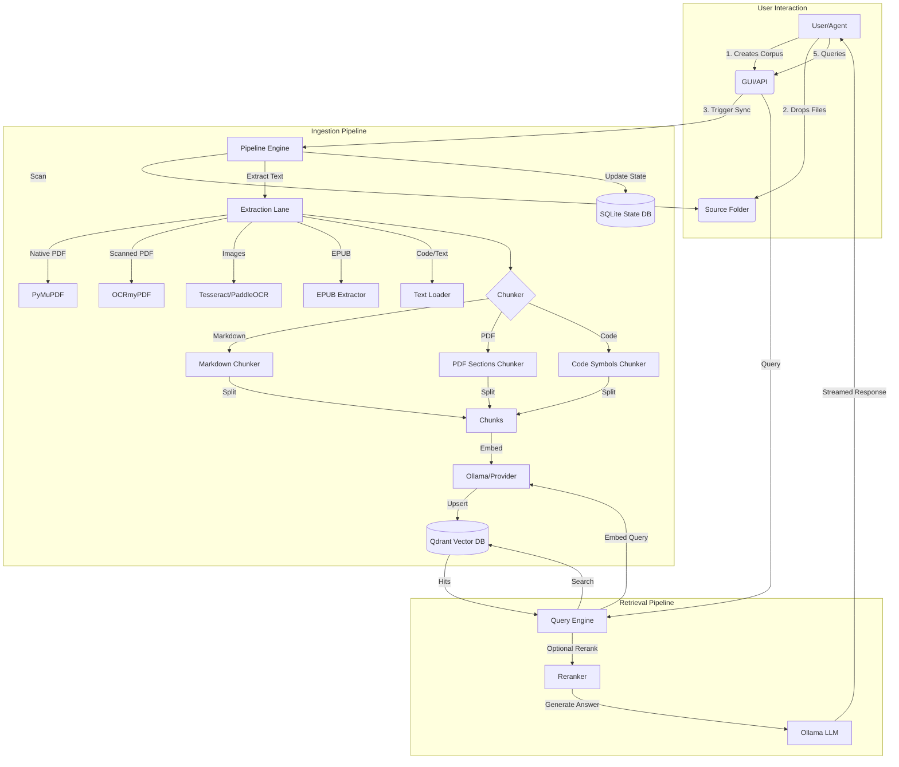

# RAGnificent

<div align="center">

**Built in an afternoon because every other local RAG setup was either
too simple to be useful or too complex to actually run.**

[](https://opensource.org/licenses/MIT)
[](https://www.python.org/)
[](https://qdrant.tech/)
[](https://ollama.com/)

</div>

RAGnificent is a local-first document intelligence service. Drop files
into a folder, trigger a sync, and get a persistent queryable vector
index back — with streaming LLM answers and citations. Each corpus
gets its own isolated Qdrant collection, its own chunking strategy,
and its own LLM config. No shared state between document sets. No
external API calls required.

---

## What Makes This Different

| | Typical local RAG | RAGnificent |
|---|---|---|
| **Corpus isolation** | Shared index | Per-corpus Qdrant collection |
| **Chunking** | One fixed strategy | Markdown / PDF / Code-aware routing |
| **PDF handling** | Text extraction only | OCR fallback per-page when text is sparse |
| **Deduplication** | None | SHA-256 content hash, idempotent ingest |
| **Config** | Global only | Per-corpus `corpus.yaml` overrides |
| **Interface** | CLI or nothing | Web GUI + REST API + CLI |
| **Deployment** | Script or nothing | Docker Compose or bare Python |

---

## Architecture


```mermaid
graph TD
    subgraph User Interaction
    A[User/Agent] -->|1. Creates Corpus| B(GUI/API)
    A -->|2. Drops Files| C(Source Folder)
    A -->|5. Queries| B
    end

    subgraph Ingestion Pipeline
    B -->|3. Trigger Sync| D[Pipeline Engine]
    D -->|Scan| C
    D -->|Extract Text| E[Extraction Lane]
    E -->|Native PDF| F[PyMuPDF]
    E -->|Scanned PDF| F2[OCRmyPDF]
    E -->|Images| F3[Tesseract/PaddleOCR]
    E -->|EPUB| F4[EPUB Extractor]
    E -->|Code/Text| G[Text Loader]
    E --> H{Chunker}
    H -->|Markdown| H1[Markdown Chunker]
    H -->|PDF| H2[PDF Sections Chunker]
    H -->|Code| H3[Code Symbols Chunker]
    H1 & H2 & H3 -->|Split| I[Chunks]
    I -->|Embed| J[Ollama/Provider]
    J -->|Upsert| K[(Qdrant Vector DB)]
    D -->|Update State| L[(SQLite State DB)]
    end

    subgraph Retrieval Pipeline
    B -->|Query| M[Query Engine]
    M -->|Embed Query| J
    M -->|Search| K
    K -->|Hits| M
    M -->|Optional Rerank| N[Reranker]
    N -->|Generate Answer| O[Ollama LLM]
    O -->|Streamed Response| A
    end
```

---

## Features

### Ingestion
- SHA-256 hash deduplication — skips already-processed files, handles incremental updates
- Lane-based extraction routing: PyMuPDF for native PDFs, OCRmyPDF for scanned PDFs, Tesseract/PaddleOCR for images, dedicated EPUB extractor, text/code loader
- OCR fallback per-page when text density falls below a configurable threshold
- Three chunking strategies: Markdown header-aware, PDF paragraph-based with overlap, Python function/class symbol-aware

### Per-Corpus Isolation
- Each corpus gets its own Qdrant collection — no cross-contamination between document sets
- Per-corpus `corpus.yaml` overrides chunking strategy, LLM model, and embedding settings
- Corpus-specific inbox folder; drop files and trigger sync

### Retrieval
- Vector similarity search with streaming LLM-generated answers
- Source citations returned with every response
- Optional post-retrieval reranking stage (pluggable)
- Configurable `top_k`, model selection per query

### Interface
- Web GUI: dashboard, RAG search, corpus management, corpus creation
- REST API: health, query, ingest trigger endpoints
- CLI: `init-db`, `serve`, `ingest`, `ingest-file` commands

### Engineering
- Thread-safe SQLite with WAL mode and thread-local connections
- Async non-blocking I/O — blocking operations run via `asyncio.to_thread()`
- FastAPI dependency injection throughout — no module-level globals
- O(1) Qdrant collection existence checks with caching
- Path traversal protection: corpus IDs validated against strict regex with path resolution verification
- YAML sanitization: user inputs sanitized via `yaml.safe_dump()` before writes

---

## Quickstart

### Option 1 — Docker (recommended)

```bash
cp .env.example .env
docker-compose up -d
# Service: http://localhost:8008
```

### Option 2 — Bare Python

**Linux/macOS:**
```bash
./scripts/linux/setup.sh
cp .env.example .env
./scripts/linux/init_state_db.sh
./scripts/linux/run.sh
```

**Windows (PowerShell):**
```powershell
./scripts/windows/setup.ps1
cp .env.example .env
./scripts/windows/init_state_db.ps1
./scripts/windows/run.ps1
```

---

## Usage

1. Open `http://localhost:8008/gui/create-corpus` and create a corpus
2. Drop files into `rag_library/corpora/<corpus_id>/inbox/`
3. Trigger ingestion via the GUI, API, or CLI
4. Query at `/gui/search` — select a corpus, ask a question, get a streamed answer with citations

```bash
# CLI usage
python -m app.cli ingest --corpus <corpus_id>
python -m app.cli ingest-file /path/to/file.pdf --corpus <corpus_id>
```

---

## API

| Method | Path | Description |
|--------|------|-------------|
| `GET` | `/health` | Health check |
| `POST` | `/api/query` | RAG query (`query`, `corpus_id`, `top_k`, `llm_model`) |
| `GET` | `/api/query/models` | List available LLM models |
| `POST` | `/api/ingest/run` | Trigger ingestion (optional `corpus_id`) |
| `GET` | `/gui/*` | Web GUI pages |

---

## Configuration

`.env` key settings:

| Variable | Default | Description |
|----------|---------|-------------|
| `API_PORT` | `8008` | Server port |
| `QDRANT_URL` | — | Qdrant connection URL |
| `EMBED_PROVIDER` / `EMBED_MODEL` | — | Embedding provider and model |
| `LIBRARY_ROOT` | `rag_library` | Root directory for corpora and data |

Per-corpus — edit `rag_library/corpora/<id>/corpus.yaml` to override chunking strategy, LLM model, and vector settings for that corpus specifically.

---

## Requirements

- Python 3.11+
- [Ollama](https://ollama.com/) for embeddings and LLM inference
- Qdrant (Docker recommended)
- Optional: Tesseract, Ghostscript, OCRmyPDF, PaddleOCR for OCR

---

## Testing

```bash
pytest tests/
```

Tests run against in-memory SQLite and temporary directories — no running Qdrant or Ollama instance required.

---

## Stack

- **Extraction** — PyMuPDF, OCRmyPDF, Tesseract, PaddleOCR, EPUB extractor
- **Vector store** — Qdrant (on-disk, per-corpus collections)
- **Embeddings / LLM** — Ollama (local, no external API calls)
- **State** — SQLite with WAL mode
- **API** — FastAPI with HTMX-powered web GUI
- **Deployment** — Docker Compose or bare Python

---

## Author

Douglas J. Sweeting II
Glen Burnie, MD · 443-763-7955 · douglas.j.sweeting@gmail.com · [github.com/SweetingTech](https://github.com/SweetingTech)

---

## License

MIT License — see [LICENSE](LICENSE) for details.
