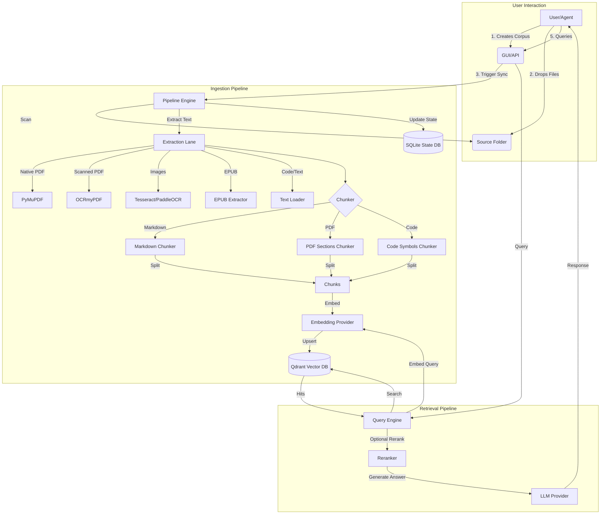

# RAGnificent

## Voltron Canonical Envelope

Voltron is the spine of the Jazzy stack and owns the canonical cross-system envelope. This folder's role: Memory/retrieval cortex / grounded knowledge and citations. Reports governed_retrieval evidence with corpus and citation provenance.

Current boundary messages should use the shared outer fields documented in the Voltron canonical envelope spec: schemaVersion, system, producer, agent, messageType, generatedAt, correlationId, readOnly, confidence, sources, brief, payload, risks, warnings, and metadata. Keep native details inside brief or payload; do not flatten system-specific records.

### Experiment trust boundary

RAGnificent never upgrades a source receipt because a caller labels it as
trusted. When a trusted integration asks to promote experiment-derived
knowledge, it accepts exactly one private-evaluation wire format:
`voltron.experiment_evaluation_attestation.v1`. It is the root canonical,
camel-case redacted attestation (`schemaVersion`, `experimentId`,
`candidateDigest`, `lane`, `status`, aggregate `categories`, bounded `usage`,
`rewardHackingSignals`, `evidenceHash`, `issuer`, `keyId`, and `signature`).
The private lane requires `lane: private`, a valid HMAC signature, a `passed`
status, no reward-hacking signals, operator approval where applicable, and
production verification for promoted/privileged knowledge classes.

JazzyMonitor's compact snake-case storage record is an internal projection,
not a second input dialect. RAGnificent deliberately rejects it, as well as
private test bodies, prompts, answers, transcripts, logs, and caller-supplied
category summaries. An evaluation result can be evidence for a later governed
decision; it is never production authority by itself.

## Agent Operating Instructions

This document is a standalone operating brief for human-agent pair programming. Agents must treat the guidance here as actionable working instructions, not background context.

When working from this file:

- Treat repeated setup, auth, path, and workflow context as intentional. Do not remove, collapse, or replace repeated blocks just to reduce duplication.
- Prefer repository-relative and workspace-relative paths. Do not introduce workstation-specific absolute paths unless documenting a user-provided local override.
- Preserve enough context for another agent to act from this file alone, including purpose, entry points, auth expectations, integration paths, run/test commands, and safety constraints.
- Keep secrets out of documentation. Use variable names and placeholders for tokens, cookies, API keys, OAuth refresh tokens, and credentials.
- If behavior, paths, ports, auth, workflow routing, or integration contracts change, update this file in the same change set.
- Keep the documentation agent-operable: concrete commands, expected locations, and current assumptions are more useful than high-level summaries.

<div align="center">

**Built in an afternoon because every other local RAG setup was either
too simple to be useful or too complex to actually run.**

[](https://opensource.org/licenses/MIT)
[](https://www.python.org/)
[](https://qdrant.tech/)
[](https://ollama.com/)

</div>

RAGnificent is a document intelligence service that runs locally or connects to cloud AI providers. Drop files into a folder, trigger a sync, and get a persistent queryable vector index back with optional LLM answers and retrieval evidence. Each corpus gets its own Qdrant collection and `corpus.yaml` policy. Corpus metadata and ingest records share the service's SQLite state database, so isolation applies to vector collections and per-corpus configuration, not to the process or state-database instance.

---

## Jazzy Workspace Gateway

The repository's direct host URL defaults to `http://127.0.0.1:8008`. In Docker, set `API_HOST=0.0.0.0` inside the container; Compose still publishes the service only on host loopback. A workspace can map the host side to `8018` with `RAGNIFICENT_HOST_PORT=8018` when `8008` is already assigned.

AgentsOfJazzy can expose RAGnificent through these consumer-owned proxy routes:

- `http://localhost:9002/v1/ragnificent/health`
- `http://localhost:9002/v1/ragnificent/corpora`
- `http://localhost:9002/v1/ragnificent/ingest/run`
- `http://localhost:9002/v1/ragnificent/query`

This repository neither creates nor authenticates those proxy routes. Verify their availability and `x-auth` contract in the current AgentsOfJazzy source before using them.

## Trombone Memory Role

Updated: 2026-04-20

RAGnificent provides the vector retrieval and source-receipt boundary that Trombone or Agent Harness can use for AAR learning and operator memory. RAGnificent does not route Trombone jobs or define an Agent Harness specialist name; those decisions remain consumer-owned.

The consumer documentation names this dedicated corpus ID:

```text
trombone-operator-memory
```

This repository and its setup scripts do not create that corpus. Discover it with `GET /api/corpora` before relying on it, and keep operator memory separate from chat/user corpora when provisioning it. RAGnificent does not hardcode Trombone corpus allow/deny names: `POST /api/agenda/evidence/brief` applies the caller-supplied `allowed_corpora` and `denied_corpora` lists without ingesting or mutating a corpus.

---

## What Makes This Different

| | Typical local RAG | RAGnificent |
|---|---|---|
| **Corpus isolation** | Shared index | Per-corpus Qdrant collection |
| **Chunking** | One fixed strategy | Markdown / PDF / Code-aware routing |
| **PDF handling** | Text extraction only | OCR fallback per-page when text is sparse |
| **Deduplication** | None | SHA-256 content hash, idempotent ingest |
| **Config** | Global only | Per-corpus `corpus.yaml` overrides |
| **Interface** | CLI or nothing | Web GUI + REST API + CLI |
| **AI providers** | Local only | Ollama, OpenAI, Anthropic, OpenRouter |
| **Deployment** | Script or nothing | Docker Compose or bare Python |

---

## Architecture


```mermaid
graph TD
    subgraph User Interaction
    A[User/Agent] -->|1. Creates Corpus| B(GUI/API)
    A -->|2. Drops Files| C(Source Folder)
    A -->|5. Queries| B
    end

    subgraph Ingestion Pipeline
    B -->|3. Trigger Sync| D[Pipeline Engine]
    D -->|Scan| C
    D -->|Extract Text| E[Extraction Lane]
    E -->|Native PDF| F[PyMuPDF]
    E -->|Scanned PDF| F2[OCRmyPDF]
    E -->|Images| F3[Tesseract/PaddleOCR]
    E -->|EPUB| F4[EPUB Extractor]
    E -->|Code/Text| G[Text Loader]
    E --> H{Chunker}
    H -->|Markdown| H1[Markdown Chunker]
    H -->|PDF| H2[PDF Sections Chunker]
    H -->|Code| H3[Code Symbols Chunker]
    H1 & H2 & H3 -->|Split| I[Chunks]
    I -->|Embed| J[Embedding Provider]
    J -->|Upsert| K[(Qdrant Vector DB)]
    D -->|Update State| L[(SQLite State DB)]
    end

    subgraph Retrieval Pipeline
    B -->|Query| M[Query Engine]
    M -->|Embed Query| J
    M -->|Search| K
    K -->|Hits| M
    M -->|Optional Rerank| N[Reranker]
    N -->|Generate Answer| O[LLM Provider]
    O -->|Response| A
    end
```

---

## Features

### Ingestion
- SHA-256 hash deduplication — skips already-processed files, handles incremental updates
- Lane-based extraction routing: PyMuPDF for native PDFs, OCRmyPDF for scanned PDFs, Tesseract/PaddleOCR for images, dedicated EPUB extractor, text/code loader
- OCR fallback per-page when text density falls below a configurable threshold
- Optional Ollama OCR lane for troublesome PDFs/images — configure a vision OCR model such as `hf.co/ggml-org/GLM-OCR-GGUF:Q8_0`; if the Ollama OCR call fails, image OCR falls back to Tesseract
- Three chunking strategies: Markdown header-aware, PDF paragraph-based with overlap, Python function/class symbol-aware
- OpenAI-compatible embedding requests are batched with retry/backoff so large PDFs and textbook-scale corpora are less likely to fail on remote embedding providers
- Live ingest progress from `/api/ingest/status` and the GUI overlay: total files, completed count, current file, processed/skipped/failed counts, percent complete
- Retry failed files from the corpus management page without re-running a full corpus scan
- Rebuild a corpus from the Manage page or API: clears that corpus's existing vectors + ingest state, then reprocesses all source files from scratch with the current pipeline

### Per-Corpus Isolation
- Each corpus gets its own Qdrant collection — no cross-contamination between document sets
- Per-corpus `corpus.yaml` overrides chunking strategy, LLM model, and embedding settings
- Embeddings are chosen at corpus creation / ingest time, not retroactively from the global Settings page
- Query-time embedding resolution follows the corpus config, so retrieval stays aligned with the vectors that corpus was built with
- Corpus-specific inbox folder; drop files and trigger sync
- Delete a corpus from the GUI — removes Qdrant collection, SQLite records, and directory

### Multi-Provider AI Support
- **Ollama** — local inference on the machine or anywhere on your LAN (`http://hostname:11434`)
- **OpenAI** — GPT-4.x, GPT-5.x, o-series models via the ChatGPT API
- **Anthropic** — Claude 3.x, Claude 4.x models via the Claude API
- **OpenRouter** — access 200+ models from a single API key (GPT, Claude, Gemini, DeepSeek, Llama, Qwen, Mistral, and more)
- Provider and model configurable globally in Settings, or overridden per-corpus

### Model Catalog
- `models_catalog.yaml` at the project root is the single source of truth for all UI dropdowns
- Organized by role (`embedding` / `llm`) and provider
- Edit this file to add, remove, or reorder models without touching any code

### Embedding Presets
- `embedding_presets.yaml` defines user-facing ingest presets such as `EPUB General`, `EPUB Technical`, `EPUB Academic`, `EPUB Budget`, `PDF General`, `PDF Technical`, `PDF Academic`, and `PDF Budget`
- Presets auto-fill embedding provider, embedding model, base URL, and chunking defaults during corpus creation
- Users can still override any preset field before deploying a corpus
- Presets are saved into each corpus config so the ingest pipeline and query path use the same embedding policy later

### Settings & Connection Testing
- `/gui/settings` — configure embedding and LLM providers, models, and base URLs from the browser
- **Test Connection** button per provider — makes a real minimal API call and shows pass/fail inline before you save
- API key status table shows which keys are loaded from your `.env` file
- Hosted provider base URLs auto-fill and stay locked to the provider default; Ollama remains editable for custom LAN / local endpoints
- The embedding section on Settings is now treated as defaults for new corpora plus a connection test harness; existing corpora keep the embedding model they were ingested with

### Retrieval
- Vector similarity search with LLM-generated answers
- Every query response returns `hits`; the structured `citations` list is populated for pinned `voltron-repository-docs` provenance and is otherwise empty rather than inferred
- `POST /api/agenda/evidence/brief` can convert selected vector hits into bounded citation records for governed agenda retrieval
- Optional post-retrieval reranking stage (pluggable)
- Configurable `top_k`, `generate_answer`, and `include_experimental`; HTTP `llm_model` overrides work only for IDs in `RAGNIFICENT_ALLOWED_QUERY_MODEL_OVERRIDES`

### Interface
- Web GUI: dashboard, RAG search, corpus management, corpus creation, settings
- Live feedback: spinner overlay during operations, toast notifications on completion
- Corpus creation flow includes ingest-time embedding presets plus manual overrides for provider, model, base URL, and chunking
- Corpus management page shows embedding preset, embedding model, chunking settings, failed-file count, sync progress, and a retry-failed action
- Corpus management page also includes a `Rebuild` action for full corpus reprocessing without deleting the corpus definition itself
- REST API: health, query, ingest trigger, connection test endpoints
- CLI: `init-db`, `serve`, `ingest`, `ingest-file` commands

### Engineering
- Full-restart file watcher (`watcher.py`) — detects changes to `.py`, `.html`, `.yaml`, `.css`, `.js` and restarts the entire server process tree; no stale-import issues
- Thread-safe SQLite with WAL mode and thread-local connections
- Async non-blocking I/O — blocking operations run via `asyncio.to_thread()`
- `lru_cache` singletons for services — eliminates per-request re-initialization overhead
- 30-second TTL count cache on Qdrant vector counts
- Path traversal protection: corpus IDs validated against strict regex with path resolution verification
- YAML sanitization: user inputs sanitized via `yaml.safe_dump()` before writes
- Windows and Linux run scripts auto-start local Qdrant with `docker compose up -d qdrant` when `vector_db.url` points at `localhost:6333`

---

## Quickstart

### Option 1 — Docker (recommended)

```bash
cp .env.example .env
# Edit .env and add your API keys (optional — only needed for cloud providers)
docker compose up -d
# Service: http://localhost:8008
```

Before Docker startup, use container-visible values in `.env` instead of the bare-Windows defaults:

```env
API_HOST=0.0.0.0
STATE_DB_PATH=/app/rag_library/state/ingest.sqlite
```

If another workspace service owns host port `8008`, choose another host-published port before starting Docker:

```env
RAGNIFICENT_HOST_PORT=8018
```

With that setting, RAGnificent still listens on `8008` inside the container, but the host URL becomes:

```text
http://localhost:8018
```

Any direct consumer should then use:

```env
RAGNIFICENT_URL=http://localhost:8018
```

### Option 2 — Bare Python (Windows)

```powershell
./scripts/windows/setup.ps1
copy .env.example .env
# Edit .env and add your API keys (optional)
./scripts/windows/init_state_db.ps1
./scripts/windows/run.ps1
```

`setup.ps1` installs dependencies and, when `ollama` is available, pulls the required local models for the current configuration. `run.ps1` starts the full-restart watcher and, when `config.yaml` points Qdrant at `http://localhost:6333`, also tries to bring up the local `qdrant` container automatically.

### Option 3 — Bare Python (Linux/macOS)

```bash
./scripts/linux/setup.sh
cp .env.example .env
./scripts/linux/init_state_db.sh
./scripts/linux/run.sh
```

`setup.sh` installs dependencies and, when `ollama` is available, pulls the required local models for the current configuration. `run.sh` follows the same local-Qdrant auto-start behavior when `vector_db.url` is `localhost:6333`.

### Pulling Ollama models manually

```bash
python scripts/pull_ollama_models.py --mode required
python scripts/pull_ollama_models.py --mode catalog
```

`required` pulls the minimum local working set plus any Ollama OCR model configured in `config.yaml`. `catalog` pulls every Ollama model listed in `models_catalog.yaml`, plus the configured Ollama OCR model when applicable.

### Stopping the server (Windows)

```powershell
./scripts/windows/stop.ps1
```

This kills the entire process tree (watcher + uvicorn workers) and checks port `8008`. The script does not read `API_PORT`; if bare Python is running on an override port, stop that listener separately.

---

## API Keys (.env Setup)

API keys are never hardcoded. Copy `.env.example` to `.env` and fill in the keys for the providers you want to use. Ollama requires no key.

```env
# Anthropic (Claude models)
ANTHROPIC_API_KEY=sk-ant-...

# OpenAI (GPT models)
OPENAI_API_KEY=sk-...

# OpenRouter (access to 200+ models)
OPENROUTER_API_KEY=sk-or-...
```

The Settings page (`/gui/settings`) shows which keys are currently loaded.

If you change `.env`, restart the app. The watcher reloads code, templates, CSS, and YAML, but it does not watch `.env`.

---

## Usage

### Via the Web GUI

1. Open `http://localhost:8008`
2. Go to **Settings** to set provider defaults and verify API connectivity with **Test Connection**
3. Go to **Deploy New Librarian** — give it an ID, point `source_path` at any folder on the machine, and choose an **Embedding Preset** or customize the embedding + chunking settings
4. Trigger ingestion via the Manage page and watch live progress
5. Query at `/gui/search` — select a corpus, ask a question, get an answer with citations

### Via the API (legacy local administration)

The examples below remain for the local administrator UI/CLI migration path.
New Agent Harness, AoJ, and Wiki.js source integrations must use the governed
source-receipt API above rather than submitting `source_path` values.

```bash
# Create a corpus pointed at any local folder
curl -X POST http://localhost:8008/api/corpora \
  -H "Content-Type: application/json" \
  -d '{"corpus_id":"my_docs","description":"My documents","source_path":"./documents/research","embedding_preset":"epub_general","embedding_provider":"openrouter","embedding_model":"qwen/qwen3-embedding-8b","chunk_strategy":"heading_then_paragraph","chunk_max_tokens":700,"chunk_overlap_tokens":120}'

# Trigger ingestion
curl -X POST "http://localhost:8008/api/ingest/run?corpus_id=my_docs"

# Rebuild a corpus from scratch using the current OCR/chunking/embedding pipeline
curl -X POST "http://localhost:8008/api/ingest/run?corpus_id=my_docs&rebuild=true"

# Retry only failed files for a corpus
curl -X POST "http://localhost:8008/api/ingest/run?corpus_id=my_docs&retry_failed_only=true"

# Query the database
curl -X POST http://localhost:8008/api/query \
  -H "Content-Type: application/json" \
  -d '{"query":"What is the main finding?","corpus_id":"my_docs","top_k":5}'

# Test a provider connection
curl -X POST http://localhost:8008/api/test-connection \
  -H "Content-Type: application/json" \
  -d '{"role":"llm","provider":"anthropic","model":"claude-sonnet-4-6"}'
```

### Via the CLI

```bash
python -m app.cli ingest --corpus <corpus_id>
python -m app.cli ingest --corpus <corpus_id> --rebuild
python -m app.cli ingest-file /path/to/file.pdf --corpus <corpus_id>
```

### Source path vs. inbox (legacy corpus administration)

Each corpus has two document locations:

| Path | Purpose |
|---|---|
| `source_path` | Local administrator-configured folder scanned by the legacy corpus workflow |
| `rag_library/corpora/<id>/inbox/` | Drop zone inside the library — also scanned during ingestion |

`source_path` is the main scan target stored in the corpus config. The per-corpus `inbox/` remains available as a drop zone inside `rag_library/`. Corpus configuration and SQLite ingest state live under the configured library root; vectors live in the configured Qdrant backend and its storage volume.

---

## Governed source receipts (Voltron / Wiki.js intake)

RAGnificent has a dedicated machine-to-machine source receipt boundary for
Agent Harness and future Wiki.js compilation. It exists so a caller cannot use
the retrieval service as a remote file reader or choose a provider/model route
for a source on the fly.

The authority sequence is:

```text
Agent Harness reviewed source/evidence
  -> POST /api/source-receipts (hash-verified receipt)
  -> POST /api/source-receipts/{receipt_id}/ingest (exact file only)
  -> RAGnificent retrieval citation / Agent Harness claim evidence mapping
```

Configure `RAGNIFICENT_INTERNAL_TOKEN` before using this API. Both endpoints
require the `X-Ragnificent-Token` header even from localhost; without a
configured token they fail closed. The request names only a configured logical
root and a relative path, never an arbitrary server filesystem path:

```json
{
  "workspace_id": "voltron",
  "corpus_id": "trombone-operator-memory",
  "source_kind": "agent_artifact",
  "source_system": "agent_harness",
  "source_record_id": "task_123",
  "source_locator": {
    "root_id": "agent_harness_aar_sources",
    "relative_path": "trombone-operator-memory/lesson.md"
  },
  "content_sha256": "<sha256-of-the-file>",
  "privacy": "internal",
  "correlation_id": "corr_123",
  "idempotency_key": "stable-publisher-key"
}
```

The response contains a stable `receipt_id` and canonical locator such as
`ragnificent://source-receipts/<receipt_id>`. Agent Harness should store that
locator alongside claim evidence; it must not treat the RAG index as the
canonical claim store.

`privacy` is one of `internal`, `restricted`, or `local_only` and must match
the corpus policy. A `local_only` corpus accepts only Ollama embedding and
answer routes; OpenAI, Anthropic, and OpenRouter routes are rejected before
the source content is sent to them.

### Private Wiki publication authority

Source receipts also persist an immutable `wiki_publication` decision. This is
not a request field: RAGnificent computes it once from the administrator-owned
target corpus configuration and returns it in the receipt response. Existing
and unconfigured receipts default to `local_only`.

Only a non-`local_only` corpus with this exact typed `corpus.yaml` setting can
produce a receipt marked `private_wiki_allowed`:

```yaml
privacy: internal # or restricted
wiki_publication: private_wiki_allowed
```

Any missing, malformed, or later-changed value is `local_only`. Changing a
corpus after a receipt is created does not change that receipt's stored
authority. The setting governs publication to the authenticated private Wiki;
it does not alter provider/model locality or make any content public.

### Trust-classified receipt provenance

Receipt-backed vectors now carry a server-derived `knowledge_class`:
`por`, `validated_lesson`, `operational_evidence`, `active_experiment`,
`promoted_experiment`, `rejected_experiment`, `historical_document`, or
`unverified`. It is not accepted in the source-receipt request, so an intake
caller cannot label its own content as POR or a validated lesson. New generic
receipts default to `unverified`; an administrator-owned corpus policy can
derive only non-privileged classes from an exact trusted root/kind/system
tuple. Repository-doc snapshots are conservatively `historical_document`.

Normal retrieval excludes `active_experiment` and `rejected_experiment`, then
ranks current truth and validated evidence above operational/history/unverified
material. A caller can explicitly request experimental history with
`include_experimental: true`, but that does not raise its trust rank.

`por` and `validated_lesson` require the internal
`SourceReceiptService.promote_experiment_knowledge(...)` path, a valid
redacted Monitor private-evaluation attestation, an operator approval receipt,
and production verification. There is deliberately no public trust-promotion
route. The Ragnificent attestation key is configured out of band through
`RAGNIFICENT_PRIVATE_EVALUATION_ATTESTATION_KEY`; it must match the trusted
Monitor boundary key and must never be included in receipt payloads or docs.

### Voltron repository documentation lane

`voltron-repository-docs` is a separate source-receipt-only corpus for the
allowlisted README/docs snapshots produced by Agent Harness's documentation
catalog. It does **not** trust a broad Voltron workspace path or use the legacy
folder scan. Docker Compose mounts the host-generated
`../Agent_Harness_Template/data/runtime/wiki/documentation-snapshots` directory
read-only at `/app/voltron-documentation-snapshots`; configure
`RAGNIFICENT_VOLTRON_REPOSITORY_DOCS_ROOT` to that **container-visible** path,
install the exact corpus policy template, and submit one hash-verified
`repository_documentation` receipt per snapshot.
Queries return repo/path/commit/hash receipt citations without leaking local
snapshot paths. See [docs/voltron-repository-docs.md](docs/voltron-repository-docs.md)
and [docs/voltron-repository-docs.corpus.yaml](docs/voltron-repository-docs.corpus.yaml)
for the deployment contract.

### Legacy API migration

Existing `/api/corpora` and `/api/ingest/run` workflows remain temporarily
available for local UI/CLI compatibility. Without a token, their mutation
routes are loopback-only. Set `RAGNIFICENT_REQUIRE_INTERNAL_AUTH=true` after
the Agent Harness/AoJ callers send `X-Ragnificent-Token` to require the same
token for those legacy routes too. New Voltron and Wiki.js source work must
use source receipts; do not add new integrations to `source_path` overrides.

Browser CORS is an explicit local-origin allowlist controlled by
`RAGNIFICENT_CORS_ORIGINS`; it is not an authorization mechanism. For bare
Python, keep the service bound to `API_HOST=127.0.0.1` unless a separately
authenticated reverse proxy is in front of it. Inside Docker, bind the process
to `API_HOST=0.0.0.0`; Compose keeps the published host socket on `127.0.0.1`.

### API Reference

Browser CORS is limited to explicit local origins by default. Agents should
use the authenticated AgentsOfJazzy proxy or the controlled local service
boundary rather than relying on browser CORS.

### Corpus / Database Management

| Method | Path | Description |
|--------|------|-------------|
| `GET` | `/api/corpora` | List all RAG databases with vector counts and query endpoint |
| `GET` | `/api/corpora/{corpus_id}` | Public detail for one corpus (sanitized config and vector count; no server paths or credentials) |
| `GET` | `/api/corpora/{corpus_id}/stats` | Uncached vector count plus SQLite success/failed file counts |
| `POST` | `/api/corpora` | Legacy administrator creation using a server/container-visible source folder; loopback-only without a valid internal token |
| `DELETE` | `/api/corpora/{corpus_id}` | Delete corpus — removes Qdrant collection, state records, and directory |

### Query

| Method | Path | Description |
|--------|------|-------------|
| `GET` | `/api/query/models` | Discover models from the configured Ollama endpoint; returns an empty list plus warning when unavailable |
| `POST` | `/api/query` | RAG query with `query`, `corpus_id`, `top_k`, `generate_answer`, and `include_experimental`; `llm_model` is allowlist-gated |

### Ingestion

| Method | Path | Description |
|--------|------|-------------|
| `POST` | `/api/ingest/run` | Trigger ingestion (`?corpus_id=<id>` or all). Returns `409` if another ingest job is already running |
| `POST` | `/api/ingest/run?rebuild=true` | Rebuild one corpus from scratch: clears its existing vectors + ingest state, then reprocesses all source files |
| `POST` | `/api/ingest/run?retry_failed_only=true` | Retry only failed files for a corpus |
| `GET` | `/api/ingest/status` | Current ingestion status, counts, current file, and progress percentage |
| `POST` | `/api/source-receipts` | Authenticated, hash-verified source receipt; no caller-controlled filesystem path or model route |
| `GET` | `/api/source-receipts/{receipt_id}` | Authenticated receipt/provenance lookup |
| `POST` | `/api/source-receipts/{receipt_id}/ingest` | Authenticated exact-file ingestion for an accepted receipt |

### Governed agenda evidence

| Method | Path | Description |
|--------|------|-------------|
| `GET` | `/api/agenda/evidence` | Read-only corpus inventory in the Voltron evidence envelope |
| `POST` | `/api/agenda/evidence/brief` | Read-only, allow/deny-filtered retrieval brief with bounded citations and optional answer generation |

### Utilities

| Method | Path | Description |
|--------|------|-------------|
| `POST` | `/api/test-connection` | Legacy mutation-gated provider probe using `role`, `provider`, `model`, and optional `base_url` |
| `GET` | `/health` | Probes Qdrant plus configured embedding/answer providers; returns `200` when all are healthy and `503` when degraded |

### Connecting an AI agent

```
1. GET  /api/corpora          → discover databases, pick corpus_id
2. POST /api/ingest/run       → index documents if vector_count is 0
3. POST /api/query            → { "query": "...", "corpus_id": "..." }
```

---

## Configuration

### `.env` — runtime environment

| Variable | Description |
|----------|-------------|
| `API_PORT` | Bare-Python/container listen port (default `8008`); leave it at `8008` with the current Compose container mapping |
| `API_HOST` | Bare-Python default is `127.0.0.1`; use `0.0.0.0` inside Docker, whose published host socket remains loopback-only |
| `RAGNIFICENT_HOST_PORT` | Docker host-published port (default `8008`; use `8018` only when the workspace port map requires it) |
| `RAGNIFICENT_INTERNAL_TOKEN` | Required token for `/api/source-receipts`; also protects legacy mutations in strict mode |
| `RAGNIFICENT_REQUIRE_INTERNAL_AUTH` | Set `true` only after existing API callers send `X-Ragnificent-Token` |
| `RAGNIFICENT_TRUSTED_SOURCE_ROOTS` | Optional JSON map of logical root IDs to server paths for source receipts |
| `RAGNIFICENT_VOLTRON_REPOSITORY_DOCS_ROOT` | Docker-container path `/app/voltron-documentation-snapshots` for the read-only Agent Harness documentation snapshot mount |
| `RAGNIFICENT_CORS_ORIGINS` | Explicit comma-separated browser origin allowlist; wildcard values are ignored |
| `RAGNIFICENT_ALLOWED_QUERY_MODEL_OVERRIDES` | Explicit model-ID allowlist for HTTP `llm_model` overrides; empty disables overrides |
| `STATE_DB_PATH` | Active override for the SQLite state path; use `/app/rag_library/state/ingest.sqlite` in Docker |
| `QDRANT_URL` | Compatibility placeholder in `.env.example`; the current loader reads `vector_db.url` from the selected config YAML |
| `LIBRARY_ROOT` | Compatibility placeholder in `.env.example`; the current loader reads `library_root` from the selected config YAML |
| `ANTHROPIC_API_KEY` | Anthropic API key |
| `OPENAI_API_KEY` | OpenAI API key |
| `OPENROUTER_API_KEY` | OpenRouter API key |

### `config.yaml` — provider and model settings

Managed by the Settings UI. Controls default embedding provider/model and default LLM provider/model for new corpora plus connection testing. Per-corpus overrides live in `rag_library/corpora/<id>/corpus.yaml`. The current loader takes `library_root` and `vector_db.url` from this YAML (or `config.docker.yaml` in Compose); `STATE_DB_PATH` is the environment override for SQLite.

### `config.yaml` — OCR settings

The `ocr` section controls scanned-PDF/image OCR. Supported backends include:

- `ocrmypdf` for whole-document scanned PDF workflows
- `paddleocr` when PaddleOCR is installed
- `ollama_glm_ocr` / `glm_ocr` / `ollama` for a vision-capable Ollama OCR model such as `hf.co/ggml-org/GLM-OCR-GGUF:Q8_0`

When the Ollama OCR backend is enabled, configure:

- `ocr.ollama.base_url`
- `ocr.ollama.model`
- `ocr.ollama.prompt`

### `embedding_presets.yaml` — corpus creation presets

Defines the user-facing presets shown on the Deploy New Librarian page. Each preset can set:

- embedding provider
- embedding model
- embedding base URL
- chunking strategy
- chunk target tokens
- chunk overlap tokens

Current preset families:

- EPUB presets use heading-aware chunking for prose-heavy and structured ebook content
- PDF presets use paragraph-oriented chunking for manuals, textbooks, research papers, and scanned/native PDF workflows

### `models_catalog.yaml` — UI dropdowns

Edit this file to add, remove, or reorder models in the provider dropdowns. Structure:

```yaml
embedding:
  ollama:
    models:
      - id: "nomic-embed-text"
        display_name: "nomic-embed-text"
        notes: "768-dim. Recommended default."
  openai:
    models: [...]
  openrouter:
    models: [...]

llm:
  ollama:
    models: [...]
  openai:
    models: [...]
  anthropic:
    models: [...]
  openrouter:
    models: [...]
```

Current catalog/provider flow:

- direct OpenAI models and embeddings come from the `openai` sections
- direct Anthropic LLMs come from the `anthropic` section
- OpenRouter models use provider-prefixed IDs like `openai/gpt-5.4-mini` and `qwen/qwen3-embedding-8b`
- hosted providers auto-fill their standard API endpoint in the UI; Ollama is the editable local/LAN exception

---

## Requirements

- Python 3.11+
- Qdrant (Docker recommended, or use Qdrant Cloud)
- At least one of:
  - [Ollama](https://ollama.com/) for local/LAN inference (no API key required)
  - An Anthropic, OpenAI, or OpenRouter API key for cloud inference
- Optional OCR tooling: Tesseract, Ghostscript, OCRmyPDF, PaddleOCR
- Optional Ollama vision OCR model for the Ollama OCR backend, for example `hf.co/ggml-org/GLM-OCR-GGUF:Q8_0`

---

## Testing

```bash
python -m compileall app
python -m pytest
```

The tracked pytest suite covers agenda routes, knowledge trust, local-only policy, query-route policy, and source-receipt security. Compile checks and live ingest/query verification remain separate runtime checks.

---

## Stack

- **Extraction** — PyMuPDF, OCRmyPDF, Tesseract, PaddleOCR, EPUB extractor
- **Vector store** — Qdrant (on-disk, per-corpus collections)
- **Embeddings** — Ollama (local/LAN), OpenAI, OpenRouter
- **LLM** — Ollama (local/LAN), OpenAI, Anthropic (Claude), OpenRouter
- **State** — SQLite with WAL mode
- **API** — FastAPI with HTMX-powered web GUI
- **Dev server** — Full-restart file watcher (`watcher.py`) — no stale imports
- **Deployment** — Docker Compose or bare Python

---

## Author

Douglas J. Sweeting II
Glen Burnie, MD · 443-763-7955 · douglas.j.sweeting@gmail.com · [github.com/SweetingTech](https://github.com/SweetingTech)

---

## License

MIT License — see [LICENSE](LICENSE) for details.
## Jazzy Workspace Integration Paths

Updated: 2026-04-13

This README is part of the Voltron workspace documentation set. The following are consumer-owned cross-stack references, not configuration owned or verified by this repository; check each path in its owning repository before relying on it:

- Shared auth source: `JazzyTheAI/.env`, variable `AGENTS_AUTH`.
- AgentsOfJazzy auth loader: `AgentsOfJazzy/packages/common/env_bridge.py`.
- AgentsOfJazzy startup bridge: `AgentsOfJazzy/start.ps1`; override the JazzyTheAI env path with `JAZZYTHEAI_ENV_PATH` when needed.
- Auth compatibility files: `AgentsOfJazzy/packages/common/auth.py`, `AgentsOfJazzy/packages/common/credential_bridge.py`, `AgentsOfJazzy/.env.example`, and `AgentsOfJazzy/agentic/.env.example`.
- Auth bootstrap endpoints: `http://localhost:9002/v1/auth/bootstrap` for Control Hub and `http://localhost:7800/v1/auth/bootstrap` for Orchestrator.
- Backend bootstrap implementations: `AgentsOfJazzy/apps/control_hub/main.py`, `AgentsOfJazzy/apps/orchestrator/main.py`, and `AgentsOfJazzy/agentic/orchestrator/app/main.py`.
- Frontend shared auth code: `AgentsOfJazzy/agentic/orchestrator/app/static/common.js`; dashboard auth refresh code: `AgentsOfJazzy/agentic/orchestrator/app/static/board.js`.
- AgentsOfJazzy pages: dashboard `/static/index.html`, agents `/static/agents.html`, tools `/static/tools.html`, MCPs `/static/mcps.html`, APIs `/static/apis.html`, LLMs `/static/llms.html`, workflows `/static/workflows.html`, Threadwell feed `/static/threadwell.html`, Threadwell detail `/static/threadwell-detail.html?task_id=<task_id>`, history `/static/history.html`, sessions `/static/sessions.html`, Jazzy connection `/static/jazzy-connection.html`, task thread `/static/task-thread.html`, and connections `/static/connections.html`.
- JazzyTheAI service-to-service settings: `AGENTS_URL=http://host.docker.internal:9002`, `AGENTS_ORCHESTRATOR_URL=http://host.docker.internal:7800`, and `AGENTS_AUTH=<shared token>` in `JazzyTheAI/.env`.
- Threadwell is the process board for each request; History is the terminal-result archive. History records should link back to the matching Threadwell thread when available.
- Workflow/AAR JSON export target: `Backup/AAR/JazzyWorkflows`.
- OpenClaw and Hermes connectors should be added through the AgentsOfJazzy tool/MCP/API registries so their APIs and MCPs can be selected inside workflow nodes.

Do not document or export raw hidden chain-of-thought, API keys, cookies, OAuth refresh tokens, or other secrets. Threadwell and AAR records should contain structured process events, tool/API/MCP calls, visible agent messages, outcomes, timings, and redacted diagnostics only.
